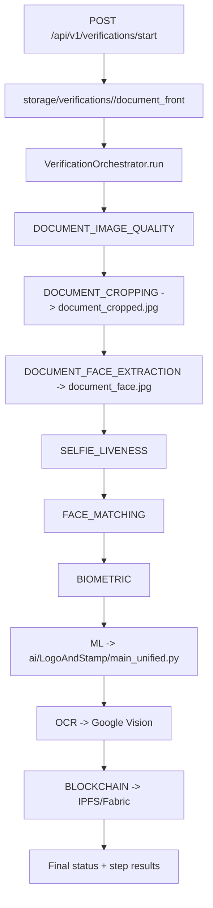

# 1) Project Overview
Watheq ?? ???? ???? ???? ?????? (????? ???? + ???? ???? + ?????? ?????). ????:
- ???? ?????? ????? ??? ????? (Quality ? Crop ? Face ? ML ? OCR ? Blockchain).
- ?????? ??????? ??? ????? (?????) ?? ???? ??????.
- ?????? ?????: status ????? + ?????? JSON + artifacts (???/??????/??????).

?????? ?????? ????:
- Final status (SUCCESS/FAILED + stage + error_message ?? DB).
- Step results ??? ????? (result_data ?? ???? verification_steps).
- Artifacts ????? (document_cropped.jpg, document_face.jpg, unified report, ???).

# 2) System Components
- `ai/card_verification`: ????? CV ????? (rectify + layout gating + ROIs + stamp/emblem + face crop).
- `ai/LogoAndStamp`: ???? anti-fraud (Logo/Stamp) ???????? classical + ML + decision fusion + reporting.
- `api/`: Backend FastAPI + orchestrator + ????? ?????? + ??? ?????? ?? DB.
- `app/`: ????? Flutter (????? ????? ????? ?????? ???? ?????? ??? ???????).
- `dashboard/`: ???? ???? Next.js (????? ??????????/???????/????????).
- `ledger/` + `infrastructure/`: Blockchain/IPFS (Fabric + IPFS) ?????? ????? ??????.
- `storage/verifications/`: ????? ?????? ?????? (??? ??????? ????????).

# 3) Repository Map
????? ?????? ???? ???????/????????:
- `api/app.py`
- `api/main.py`
- `api/routers/verification_router.py`
- `api/services/verification_orchestrator.py`
- `api/services/verification_steps_service.py`
- `api/models.py`
- `api/database.py`
- `ai/LogoAndStamp/main_unified.py`
- `ai/LogoAndStamp/main.py`
- `ai/LogoAndStamp/main_stamp.py`
- `ai/LogoAndStamp/fusion/decision_engine.py`
- `ai/LogoAndStamp/config.yaml`
- `ai/LogoAndStamp/classical/orb_matcher.py`
- `ai/LogoAndStamp/classical/ssim_matcher.py`
- `ai/LogoAndStamp/models/resnet_classifier.py`
- `ai/LogoAndStamp/models/siamese_net.py`
- `ai/card_verification/entrypoints/verify_national_id_yemen.py`
- `ai/card_verification/detect_and_rectify_card.py`
- `ai/card_verification/layout_verify.py`
- `ai/card_verification/stamp_verify.py`
- `ai/card_verification/emblem_verify.py`
- `ai/card_verification/registry/templates/national_id_yemen_v1/layout.yaml`
- `ai/Biometric/face_service.py`
- `ai/ocr/vision_service_ocr.py`
- `app/lib/main.dart`
- `app/lib/features/verification/services/verification_orchestrator_service.dart`
- `app/lib/screens/camera/document_capture_screen.dart`
- `dashboard/src/app/api/auth/login/route.ts`
- `dashboard/src/app/dashboard/document-types/page.tsx`
- `ledger/ipfs_service.py`
- `infrastructure/docker-compose.ledger.yml`

Top 15 files to read first (?? ?????):
1. `api/app.py` ? ???? ????? ??? API + middleware + routers + startup.
2. `api/main.py` ? ???? ??????? ??????? ???????.
3. `api/routers/verification_router.py` ? ???? ????? ?????? ?? ??? API.
4. `api/services/verification_orchestrator.py` ? ????? ????? ?????? ?????.
5. `api/services/verification_steps_service.py` ? ????? ???? ??? ???? (OCR/ML/Face/Blockchain).
6. `api/models.py` ? enums ??????? ??????/???? ??????.
7. `ai/LogoAndStamp/main_unified.py` ? ???? ???? anti-fraud ???????.
8. `ai/LogoAndStamp/main.py` ? ???? ???? ???????.
9. `ai/LogoAndStamp/main_stamp.py` ? ???? ?????.
10. `ai/LogoAndStamp/fusion/decision_engine.py` ? ????? ??? ????????.
11. `ai/LogoAndStamp/config.yaml` ? ROI ???? thresholds.
12. `ai/card_verification/detect_and_rectify_card.py` ? rectification ????.
13. `ai/card_verification/layout_verify.py` ? layout gating + ROIs.
14. `ai/card_verification/entrypoints/verify_national_id_yemen.py` ? orchestrator ?????.
15. `ai/Biometric/face_service.py` ? ?????? ???? (DeepFace) ????????? ?? API.

# 4) End-to-End Execution Flow (API ? AI)
**?????? ??????? ?? ??? API (??? ?? ?????):**
1) `api/main.py` ????? `api/app.py`.
2) `POST /api/v1/verifications/start` ?? `api/routers/verification_router.py`:
   - ???? ??????? ?? `storage/verifications/<id>/`:
     - `document_front`
     - `person_image`
     - `document_back` (?? ???)
   - ???? ??? ?? ???? verifications.
   - ????? `VerificationOrchestrator.run(...)` ?? background task.
3) `VerificationOrchestrator.run` (?? `api/services/verification_orchestrator.py`) ??? ???????? ???????:
   - `DOCUMENT_IMAGE_QUALITY` ? `document_image_quality()`
   - `DOCUMENT_CROPPING` ? `document_crop()` ???? `document_cropped.jpg`
   - `DOCUMENT_FACE_EXTRACTION` ? `document_face_extraction()` ???? `document_face.jpg`
   - `SELFIE_LIVENESS` ? `selfie_liveness_check()`
   - `FACE_MATCHING` ? `face_matching()` (document_face.jpg vs person_image)
   - `BIOMETRIC` ? `biometric_verify()` (document_front vs person_image)
   - `ML` ? `ml_verify()` (????? `ai/LogoAndStamp/main_unified.py`)
   - `OCR` ? `ocr_verify()` (Google Vision)
   - `BLOCKCHAIN` ? `blockchain_verify()` (IPFS + Fabric)
4) ????? ?? ????? ?????? ?? `verification_steps` ??????? ?? JSON ?? `result_data`.

**Artifacts ????????:**
- `storage/verifications/<id>/document_cropped.jpg` (?? document_crop)
- `storage/verifications/<id>/document_face.jpg` (?? document_face_extraction)
- Unified report: ????? ?????? ?? ???? tmp ???? `ml_verify()` ?? ????? ?????? ?????? ??? API.

**???? ?????? ?????? ?? ???? ??? API:**
- ????? ??? `document_crop()` ?????? ?????? ??? ML/OCR. ??? ????? ?? `ai/card_verification/detect_and_rectify_card.py`.
- ???? `ai/card_verification` ???? ??? ???? **rectified** ????? API ???? ??? **cropped**? ??? ???? ??? ??? mismatch ?? ROI ratios.

# 5) AI Anti-Fraud Module (LogoAndStamp)
**???? main_unified.py:**
- `--input <image>`
- `--config ai/LogoAndStamp/config.yaml`
- `--output <dir>`

**Outputs:**
- `*_unified_report.json` ?????:
  - `verifications.logo` + `verifications.stamp`
  - `final_decision` (AUTHENTIC / SUSPICIOUS / FORGED / INVALID_DOCUMENT)

**Logo pipeline (main.py):**
- ROI ratios ?? `config.yaml`.
- Signals: SSIM + ORB + ResNet50.
- Fusion: `DecisionEngine.fuse(...)`.
- Report: `reporting/json_reporter.py`.

**Stamp pipeline (main_stamp.py):**
- Jitter search ??? ROI (search grid) ??? `utils/roi_cropper.py`.
- Signals: SSIM + ORB + ResNet + Siamese.
- Fusion ??? `DecisionEngine`.
- Report: `*_stamp_report.json`.

**Decision Engine:**
- Rules ???? (conservative):
  - FORGED ??? ResNet ??? ??? ??????? ?? ????? ??????? ????.
  - AUTHENTIC ??? ??? ?? ???????? Strong.
  - ??? ??? SUSPICIOUS.

**Thresholds ?? `ai/LogoAndStamp/config.yaml`:**
- `thresholds.ssim`: strong_genuine=0.90, suspicious=0.70
- `thresholds.orb`: strong_genuine=0.35, suspicious=0.15, min_good_matches=10
- `thresholds.resnet`: strong_genuine=0.80, suspicious=0.50
- `stamp_thresholds` ?????? ??? ?? ??????? ?????? ?? `main_stamp.py` (????? ?? Known Issues).

**???? ????? ????? ??? API:**
- `final_decision` ?? unified report.
- `verifications.logo` ? `verifications.stamp` + scores (???????? `_compute_percent`).

# 6) Card CV Pipeline (card_verification)
- `detect_and_rectify_card.py`:
  - ????: ???? ?????.
  - ??????: `card_rectified.png`, `rectification_report.json`, `debug_contours.png`.
  - fallback: boundingRect ??? ??? quad.
- `layout_verify.py`:
  - ???? `layout.yaml` (ROIs ?????).
  - ???? ???? ????? ?????? + name_text + national_id_number.
  - ???? `report.json`, `overlay_layout_verify.png`, `stamp_mask.png`.
- `stamp_verify.py` + `emblem_verify.py`:
  - ?? ROI ?? ?????? ??????? (rectified).
  - Template match + ORB ? ????? JSON + ??? debug.
- `extract_photo_and_verify_face.py`:
  - ??? photo ROI ?? rectified.
  - ????? FaceService (DeepFace) ?? selfie.

# 7) API Layer
- Routers ????????: 
  - `api/routers/verification_router.py`
  - `api/routers/auth_router.py`
  - `api/routers/document_router.py`
  - `api/routers/ocr_router.py`
  - `api/routers/face_router.py`
  - `api/routers/ipfs_router.py`
  - `api/routers/ledger_router.py`
  - `api/routers/admin_*`
- Services ????????:
  - `verification_orchestrator.py` (pipeline)
  - `verification_steps_service.py` (actual step logic)
- Models:
  - `VerificationStage` ? `VerificationStatus` ?? `api/models.py`.
  - ??????? ??????? ?? ????? `verifications` ? `verification_steps`.

# 8) Flutter App
- ???? ????: `app/lib/main.dart`.
- ??????? ????????:
  - ????? ??????: `app/lib/screens/auth/login.dart`
  - ????? ???????: `app/lib/screens/camera/document_capture_screen.dart`
  - ?????/????: `app/lib/screens/camera/selfie_liveness_screen.dart`
  - ???????: `app/lib/screens/verification/verification_result_screen.dart`
- ??????? ???? ?????? ?? ??? API:
  - `app/lib/features/verification/services/document_verify_service.dart`
  - `app/lib/features/verification/services/verification_orchestrator_service.dart`
  - `app/lib/features/biometric/services/face_verify_service.dart`

# 9) Dashboard
- Next.js App Router ?? `dashboard/src/app/`.
- API routes ???? `dashboard/src/app/api/**`.
- ????? ?????? ?? `dashboard/src/app/dashboard/**`.
- ??????? ???? backend ??? `dashboard/src/lib/backend.ts` ? `dashboard/src/config/app-config.ts`.

# 10) Ledger & IPFS
- Fabric chaincode ?? `ledger/chaincode/watheq_cc/`.
- ????? ????? ?????? ?? `ledger/scripts/`.
- IPFS client: `ledger/ipfs_service.py`.
- API Blockchain/IPFS ?? `api/Blockchain_IPFS_API/`.
- Docker compose ??????: `infrastructure/docker-compose.ledger.yml`.

# 11) Configuration
- Root `.env` (??????? ????).
- `core/config.py` (GOOGLE_VISION_API_KEY ??????).
- `api/config.py` ? `api/database.py`.
- `ai/LogoAndStamp/config.yaml` (ROI + thresholds).
- `app/lib/core/config/app_config.dart` (base URL ???????).
- `dashboard/src/config/app-config.ts` (??????? ???????).

# 12) How to Run (Local)
- ????? ??? API:
  - `start_api.bat`
  - ?? ??????: `python api/main.py`
- ????? backend ????:
  - `start_backend.bat` ?? `run_services.bat`
- ????? Dashboard:
  - `start_dashboard.bat`
- ????? Flutter:
  - `cd app`
  - `flutter pub get`
  - `flutter run`
- ????? Anti?Fraud CLI:
  - `python ai/LogoAndStamp/main_unified.py --input <IMAGE> --config ai/LogoAndStamp/config.yaml --output output/`

# 13) Tests & Smoke Checks
- AI tests: `ai/LogoAndStamp/tests/` (pytest).
- IPFS/Blockchain smoke: `scripts/Blockchain_IPFS/ipfs_smoke_test.py`.

# 14) Troubleshooting & Known Issues
1) **Raw vs Rectified mismatch**
   - Symptom: ROI checks ?? ML results ??? ?????.
   - Cause: API ????? ??? `document_crop()` ????? `ai/card_verification` ????? ??? `detect_and_rectify_card.py`.
   - How to confirm: ???? `document_cropped.jpg` ?? `card_rectified.png` ???? ROIs.
   - Safe workaround: ????? `ai/card_verification/entrypoints/verify_national_id_yemen.py` ?????? ??? ??? ?????? ???????? ?? ????? ???? ?????? ?????? ??? ML.

2) **stamp_thresholds ??? ???????**
   - Symptom: ????? stamp ???? ??? thresholds ??????.
   - Cause: `main_stamp.py` ???? `config.stamp_verification.thresholds` ????? `config.yaml` ????? `stamp_thresholds` ???.
   - How to confirm: ???? `ai/LogoAndStamp/main_stamp.py` ? `ai/LogoAndStamp/config.yaml`.
   - Safe workaround: ????? `main_stamp.py` ?? ??? config ???? ????? `stamp_verification.thresholds`.

3) **Missing model weights**
   - Symptom: ????? ?Model checkpoint not found? ?? fallback ???? placeholder.
   - Cause: ????? ????? `ai/LogoAndStamp/models/logo_resnet50.pt` ? `models/stamp_resnet50.pt`.
   - How to confirm: ???? ?? ???? ??????? ?? ??????.
   - Safe workaround: ??? ??????? ???????? ?? ???? ??????? ?????????? ???.

4) **face_router import mismatch**
   - Symptom: ??? ????? Biometric_api ?????.
   - Cause: `api/Biometric_api/face_router.py` ?????? `ai.face_service` ??? ?????? ????? ?????? ?????? ?????? ?? `api/routers/face_router.py`.
   - How to confirm: ???? ???????.
   - Safe workaround: ??????? ???? `api/routers/face_router.py` ??? ??????? ???????.

5) **DB stage truncation**
   - Symptom: `ResponseValidationError` ???? ??? `DOCUMENT_IMAGE_QUALI`.
   - Cause: ?? `api/app.py` ??? ????? ?????? `stage/current_stage` ?? VARCHAR(20).
   - How to confirm: ??? schema ?? DB.
   - Safe workaround: ????? schema ?????? (ALTER TABLE) ?????? ??? ??????.

# 15) Integration Notes (???? ????? ???)
- ???? layout gating ?????? ?? API: ??? `DOCUMENT_CROPPING` ???? `DOCUMENT_FACE_EXTRACTION` ?? ??? `ML`.
- rectification ????? ??? ?? ???? ???? ????? ????? ??? ?? ROI ?? ML.
- ????? data contract ??? CV ? AI (??? ???):
  - `rectified_image_path`
  - `template_id`
  - `roi_pixels` (emblem/stamp/photo/name_text/national_id_number)
  - `roi_crops` (?????? ????????)
  - `layout_status` + `reason`
  - `input_metadata` (size/aspect/confidence)

# 16) Glossary
- **ROI**: Region of Interest ? ????? ?? ?? ??????.
- **Rectification**: ?????/????? ?????? ???????? ??? ????? ?????.
- **SSIM**: ???? ????? ????? ??? ??????.
- **ORB**: ????? keypoints ????????.
- **ResNet**: ????? ????? ????.
- **Siamese**: ???? ????? ????? ??????.
- **Layout Gating**: ???? ?????/????? ??? ????? ML.
